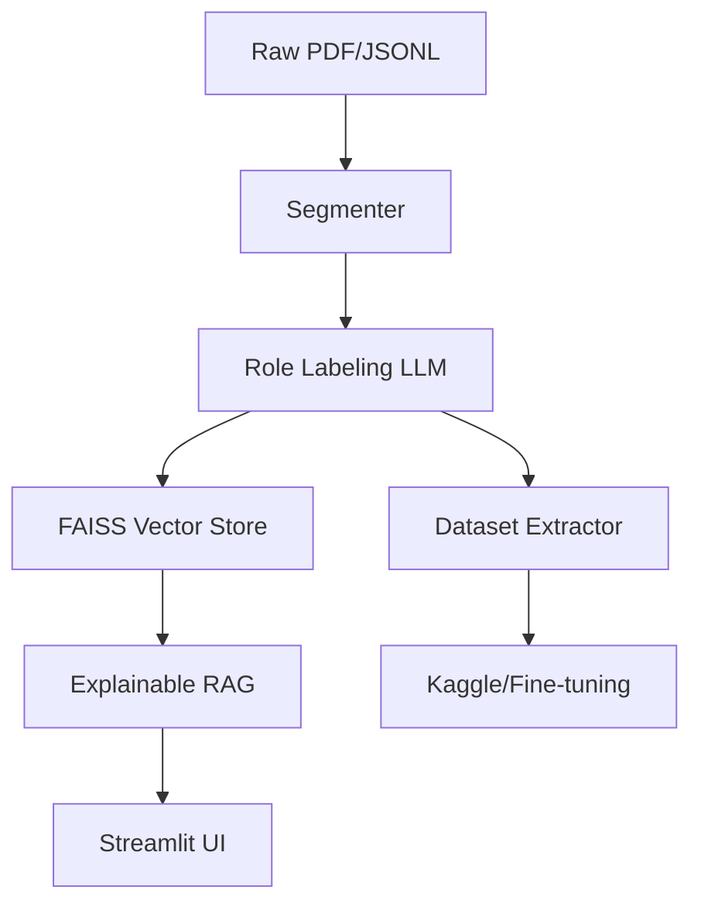

# ⚖️ JUDGE X AI
### **Indian Legal Intelligence · RAG · Rhetorical Summarization · Explainable AI**

[](https://opensource.org/licenses/MIT)
[](https://www.python.org/downloads/)
[](https://ollama.com/)

**JUDGE X AI** is a state-of-the-art legal intelligence platform designed specifically for the Indian judicial system. Unlike generic chatbots, JUDGE X understands the **rhetorical structure** of judgments, providing explainable answers and structured summaries that lawyers can trust.

---

## 🌟 Key Features

### 🧠 Rhetorical Role Labeling
Every judgment is automatically segmented and labeled into functional legal sections:
*   **Facts**: Background and history of the case.
*   **Statutory**: Direct citations of IPC, BNS, and Constitutional Articles.
*   **Reasoning**: The Court's internal legal logic and interpretation.
*   **Final Decision**: The authoritative ruling and directions.

### 🔍 Explainable RAG (XAI)
Total transparency for every answer generated:
*   **Similarity Scoring**: Real-time confidence metrics for retrieved chunks.
*   **Keyword Overlap**: Visual proof of why a specific paragraph was chosen.
*   **Source Attribution**: Interactive "Click-to-Jump" feature to see answers in their original document context.

### 📋 Structured Summarization
Generates deep-dive summaries that follow the logical flow of a senior advocate's brief (Facts → Issues → Reasoning → Decision).

### 📊 Dataset Generation (Kaggle Contribution)
A dedicated pipeline to generate high-quality, RAG-ready datasets for the Indian legal community, including over 7,000 labeled judgments.

---

## 🏗️ Architecture



---

## 🛠️ Tech Stack

*   **Core**: Python 3.11
*   **LLM Engine**: Ollama (Llama 3.1:8b-instruct)
*   **Vector Database**: FAISS
*   **NLP**: Spacy (en_core_web_sm)
*   **Frontend**: Streamlit (Custom Glassmorphic Dark UI)
*   **Parsing**: PyMuPDF (fitz)

---

## 🚀 Getting Started

### 1. Prerequisites
*   Install [Ollama](https://ollama.com/)
*   Pull the required model:
    ```bash
    ollama pull llama3.1:8b-instruct-q4_K_M
    ```

### 2. Installation
```bash
git clone https://github.com/gunjitnegi/legal-document-summariser-with-domain-specific-QA-with-Explainable-AI-
cd JUDGEXAI
python -m venv venv
source venv/bin/activate  # venv\Scripts\activate on Windows
pip install -r requirements.txt
python -m spacy download en_core_web_sm
```

### 3. Run the App
```bash
streamlit run app/streamlit_app.py
```

---

## 📂 Project Structure

*   `app/`: Streamlit frontend and UI components.
*   `src/preprocessing/`: Data cleaning, segmentation, and role labeling.
*   `src/rag/`: Vector store management and retrieval logic.
*   `src/qa/`: Ground-truth QA generation engine.
*   `data/`: (Ignored) Raw and processed legal datasets.

---

## 🤝 Contributing
Contributions are welcome! If you find a bug or have a feature request, please open an issue.

## 📄 License
Distributed under the MIT License. See `LICENSE` for more information.

---
**Created with ❤️ for the Indian Legal Community.**
